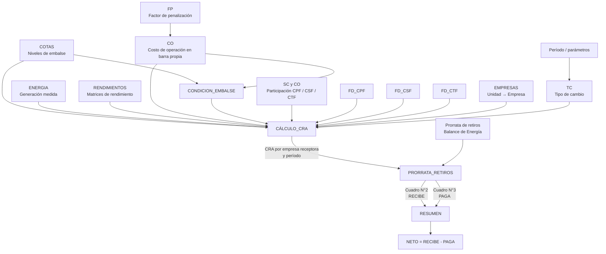

# Trazabilidad funcional del proceso mensual de REMUNERACIÓN CRA

## Alcance de este documento

Este documento reconstruye **la rama principal que genera el cuadro final de pagos de CRA** en la hoja `RESUMEN`: cuánto **RECIBE**, cuánto **PAGA** y cuál es el **NETO** de cada empresa.

El análisis **no intenta describir con igual profundidad todas las hojas, tablas y columnas del libro**. Los elementos que no participan en la cadena que termina en `RESUMEN` se clasifican como auxiliares, controles, salidas intermedias o ramas secundarias y se documentan solo cuando ayudan a entender o validar el proceso.

La regla aplicada es: **replicar y entender primero la lógica actual del Excel; no corregirla ni optimizarla todavía**. Las posibles anomalías se identifican como `POSIBLE INCONSISTENCIA / REVISAR`.

**Archivo de referencia analizado:** `5_REMUNERACIÓN_CRA_2608_Definitivo.xlsx`  
**Período del archivo de referencia:** Agosto 2026 (`AAAA=2026`, `MM=08`)  
**Alcance de la especificación:** **GENÉRICO PARA CUALQUIER PERÍODO MENSUAL**; agosto 2026 se usa únicamente como caso real de validación.  
**Salida principal:** hoja `RESUMEN`  
**Objetivo funcional:** obtener el cuadro de pago mensual por empresa del CRA.  
**Actualización de trazabilidad:** incorpora definiciones operativas entregadas para los orígenes de `TC`, `ENERGIA`, `CO`, `FP` y `SC y CO`, más una **auditoría reforzada de fórmulas y excepciones**; mantiene `COTAS` y la regla final de `CONDICION_EMBALSE` como pendientes.

---

# 0.1 Alcance temporal: el período es un parámetro, no una constante

La futura implementación **no debe quedar amarrada a agosto de 2026, a 31 días ni a 2.976 períodos**. El libro de referencia ya muestra una intención explícitamente mensual:

- `Instructivo!C3` contiene el **Año** del proceso.
- `Instructivo!C4` contiene el **Mes** del proceso.
- distintas hojas heredan ese período mediante referencias encadenadas;
- el número de días del mes se obtiene mediante una lógica equivalente a `DAY(EOMONTH(fecha_mes,0))`;
- el cálculo temporal genera normalmente **96 períodos de 15 minutos por día**;
- existe lógica específica para un día con **100 períodos** cuando el libro parametriza una hora adicional por cambio horario.

Por lo tanto, en Python la dimensión temporal debe construirse desde el período solicitado y desde las reglas de cambio horario que correspondan, **nunca mediante un valor fijo de 2.976 filas**.

### Parámetros conceptuales del período

```text
year                  = año del proceso
month                 = mes del proceso
yyyymm                = year * 100 + month
days_in_month         = cantidad real de días del mes
periods_normal_day    = 96
periods_month         = derivado del calendario y de eventuales ajustes horarios
```

Para el archivo de referencia de agosto 2026, como no existe ajuste horario dentro del mes, el resultado particular es:

```text
31 días × 96 períodos = 2.976 períodos
```

Ese valor sirve como **caso de prueba**, no como regla general.

### Cambio horario

El Excel inspeccionado contiene una regla para un día especial de **100 períodos de 15 minutos** (25 horas). Esa lógica se encuentra reflejada en `CONDICION_EMBALSE` y en la construcción temporal de `CÁLCULO_CRA`.

`PENDIENTE / REVISAR`: no se confirmó en este archivo una regla equivalente para un eventual día de **92 períodos** (23 horas). Por ello, la implementación genérica en Python debe validar expresamente los meses con transición horaria y no asumir que la única excepción posible es +1 hora.

### Regla de diseño para Python

Todos los rangos mensuales deben ser **dinámicos**. En particular:

- cantidad de períodos del mes;
- cantidad de filas de la grilla `unidad × período`;
- cantidad de filas de prorrata de retiros;
- universo de empresas receptoras;
- universo de empresas pagadoras;
- claves `AAAA`, `MM`, `AAAAMM`, día, hora y período de 15 min.

Las cantidades observadas en agosto 2026 deben utilizarse para validar equivalencia con Excel, pero no para dimensionar el proceso futuro.

---

# 0.2 Auditoría específica de fórmulas — revisión reforzada

Dado que las **fórmulas son el elemento más importante para una réplica fiel**, se realizó una segunda pasada directamente sobre la estructura de fórmulas del workbook, revisando familias, rangos, cambios de lógica y errores almacenados.

## Hallazgo transversal: el libro está en cálculo manual

El workbook está guardado con:

```text
calcMode = manual
```

Por lo tanto, **no se debe asumir que el valor almacenado en una celda calculada corresponde necesariamente a la fórmula actualmente escrita**. Para la migración a Python, la fórmula es la fuente de verdad primaria; los valores guardados sirven solo como referencia/validación cuando el libro fue recalculado conscientemente.

Esto explica por qué existen algunos valores cacheados aparentemente incompatibles con errores presentes en fórmulas aguas arriba.

## Cobertura confirmada de fórmulas en la rama principal

| Hoja | Bloque auditado | Resultado |
|---|---|---|
| `ENERGIA` | `K:L:M` | Fórmulas continuas en las **136.896 filas** de datos del ejemplo (`10:136905`). No hay huecos dentro del bloque. |
| `CO` | `A:L` | Grilla ampliamente calculada hasta la fila `41672`; se identificaron excepciones de fórmula que se documentan en `6.4`. |
| `CONDICION_EMBALSE` | `A:I` | La grilla temporal y la cota son calculadas; la condición final `K` **no está generada por una fórmula única**. |
| `SC y CO` | `AA:AC`, `AF:AG`, `AI` | Bloques calculados confirmados; existe homologación mediante `dict_SCCO`. |
| `FD_CPF` | `A` | Clave calculada en 82.584 registros. |
| `FD_CSF` | `A` | Clave calculada en 95.976 registros. |
| `FD_CTF` | `A` | Clave calculada en 369.024 registros. |
| `CÁLCULO_CRA` | núcleo `A:AI` | La grilla del ejemplo tiene **74.400 filas unidad-período**; la mayoría de las columnas principales tienen fórmula en todas esas filas. |
| `CÁLCULO_CRA` | `AL:AO` | Consolidación por período sobre 2.976 períodos en agosto 2026. |
| `PRORRATA_RETIROS` | `EF:EJ` y `EP:IV` | Enlace del CRA y asignación de pagos calculados por período. |
| `RESUMEN` | `C:F` | Agregación mensual final desde `PRORRATA_RETIROS`. |

## Casos que no deben perderse en Python

1. Existen **fórmulas de arranque distintas** de las fórmulas repetitivas en algunas secuencias temporales.
2. `CO!H` tiene **dos familias de fórmula distintas pero funcionalmente equivalentes** (`INDEX` y luego `OFFSET`).
3. Hay rangos fijos del Excel (`75000`, `30000`, `26792`, `8936`, etc.) que son artefactos del libro y **no deben transformarse en límites fijos de Python**.
4. Hay errores `#N/A` reales en algunas filas no candidatas de `CÁLCULO_CRA` y en homologaciones de `SC y CO`. Deben documentarse y controlarse, no ocultarse.
5. Las claves de FD son **horarias**, aunque el CRA se calcula a 15 minutos: cuatro períodos de 15 min comparten la misma fecha/hora para el FD.

---

# 1. Resumen ejecutivo

La lógica del libro puede entenderse mediante **dos ramas que se unen en `RESUMEN`**:

1. **Rama RECIBE:** determina el CRA que corresponde a las unidades candidatas, aplica condiciones técnicas, costo de oportunidad, participación en SSCC y factores de desempeño, y finalmente consolida el CRA por **empresa propietaria/receptora** y por período.
2. **Rama PAGA:** toma el **mismo CRA total por período** y lo distribuye entre las empresas pagadoras utilizando la **prorrata de retiros** proveniente del Balance de Energía / Balance de Transferencias.

Finalmente:

```text
NETO EMPRESA = RECIBE - PAGA
```

En los valores almacenados actualmente en el libro:

- Total `RECIBE`: **$ 48.158.346,44 CLP**
- Total `PAGA`: **$ 48.158.346,44 CLP**
- Diferencia global: **$ -0,00 CLP**, equivalente a cero salvo precisión numérica.

Esto confirma una propiedad fundamental del modelo: **el CRA distribuido a los receptores se financia completamente mediante la asignación a pagadores**.

---

# 2. Esquema gráfico de la rama principal

El archivo `Flujo_principal_CRA_generico.svg`, generado junto a este documento, contiene este mismo flujo en formato gráfico. El diagrama representa la lógica mensual y no depende de agosto 2026.



### 2.0.1 Fuentes externas ya definidas

```text
CMg ------------------------------------→ TC
Formato_Solicitud_SSAA_SSCC_Hidro_* ----→ ENERGIA
fp_*.xlsx ------------------------------→ FP ──→ CO
cvar_cra_AAMM_*.xlsx ------------------→ CO
Reporte_CRA*.xlsx ----------------------→┐
                                         ├─→ SC y CO normalizado
Cálculo_SobrecostosSSCC_*.xlsm --------→┘
RENDIMIENTOS ---------------------------→ maestro existente (no se toca)
COTAS ----------------------------------→ PENDIENTE ORIGEN
CONDICION_EMBALSE ----------------------→ PENDIENTE REGLA/ORIGEN
```

## 2.1 Lectura simple del flujo

```text
DATOS TÉCNICOS + ENERGÍA + COSTOS + SSCC + FD
                         │
                         ▼
                   CÁLCULO_CRA
                         │
                 CRA por período
                 y empresa receptora
                         │
                         ▼
                 PRORRATA_RETIROS
                   /             \
                  /               \
       quién RECIBE               quién PAGA
       el CRA calculado           según retiros
                  \               /
                   \             /
                         ▼
                      RESUMEN
                RECIBE | PAGA | NETO
```

---

# 3. Inventario orientado a la salida final

| Hoja | Rol respecto de `RESUMEN` | Relevancia | Observación |
|---|---|---:|---|
| `Instructivo` | Parámetros e instrucciones operativas | Principal / soporte | Define período y explica fuentes manuales. |
| `TC` | Tipo de cambio | Principal | Convierte CRA en USD a CLP. |
| `COTAS` | Niveles de embalse | Principal | Alimenta cota usada en condición y rendimiento. |
| `ENERGIA` | Generación medida | Principal | Entrega energía neta por unidad y período. |
| `RENDIMIENTOS` | Matriz de rendimiento | Principal | Entrega el factor `Max {}` utilizado en CRA. |
| `FP` | Factores de penalización | Principal indirecta | Alimenta `CO`. |
| `CO` | Costo de operación en barra propia | Principal | Entrega `CO_Barra_Propia`. |
| `CONDICION_EMBALSE` | Determina configuración/condición de embalse | Principal | Permite seleccionar configuración operacional. |
| `SC y CO` | Participación del CRA por CPF/CSF/CTF | Principal | Entrega porcentajes de asignación por servicio. |
| `FD_CPF` | Factor de desempeño CPF | Principal | Ajusta CRA de CPF. |
| `FD_CSF` | Factor de desempeño CSF | Principal | Ajusta CRA de CSF. |
| `FD_CTF` | Factor de desempeño CTF | Principal | Ajusta CRA de CTF. |
| `EMPRESAS` | Maestro Unidad/Configuración → Empresa | Principal | Determina empresa receptora. Hoja oculta. |
| `CÁLCULO_CRA` | Motor principal del CRA | **Crítica** | Calcula CRA unitario y consolida por empresa/período. |
| `PRORRATA_RETIROS` | Reparto del pago | **Crítica** | Une CRA recibido con prorrata de empresas pagadoras. |
| `RESUMEN` | Cuadro final | **Salida final** | `RECIBE`, `PAGA`, `NETO`. |
| `Control de Cambios` | Registro documental | Secundaria | No participa en cálculo final. |
| `TD_RENDIMIENTOS` | Auxiliar de rendimientos | Secundaria para esta rama | No se identificó referencia desde la cadena final inspeccionada. |
| `RENDIMIENTOS_MAX` | Auxiliar/resultado de rendimientos | Secundaria para esta rama | No se identificó referencia desde la cadena final inspeccionada. |
| `FP` / bloques laterales de distintas hojas | Controles/auxiliares | Mixta | Solo se consideran los bloques que efectivamente alimentan la rama final. |

---


# 3.1 Estado de definición de orígenes y cargas

Esta sección distingue lo que ya quedó **confirmado por definición operativa del usuario** de lo que aún debe estudiarse. Estas definiciones deben prevalecer para la futura carga en Python, aunque el Excel actual contenga columnas auxiliares adicionales.

| Hoja / componente | Estado | Origen / regla confirmada |
|---|---|---|
| `Instructivo` | **OK** | Se mantiene como definición operativa y de período. |
| `Control de Cambios` | **OK** | Se mantiene como registro documental; no participa en el cálculo final. |
| `TC` | **OK** | Origen: **CMg**. |
| `COTAS` | **PENDIENTE** | Falta estudiar y documentar el origen/formato exacto. |
| `ENERGIA` | **OK / origen definido** | `Formato_Solicitud_SSAA_SSCC_Hidro_MesAAAA.xlsx`. |
| `CO` | **OK / origen definido** | `cvar_cra_AAMM_*.xlsx`. |
| `CONDICION_EMBALSE` | **PENDIENTE** | Falta estudiar la construcción/origen exacto. |
| `RENDIMIENTOS` | **OK** | **No se toca**; se considera maestro técnico existente. |
| `FP` | **OK / origen definido** | Archivo tipo `fp_2603*.xlsx` según ejemplo entregado; falta confirmar si el patrón de nombre cambia dinámicamente con `AAMM`. |
| `SC y CO` | **PARCIALMENTE OK** | Se construye apilando dos orígenes: `Reporte_CRA*.xlsx` para CO y `Cálculo_SobrecostosSSCC_*.xlsm` para SC. La estructura normalizada queda definida más adelante. |

## 3.2 Principio para la futura carga en Python

La implementación no debe intentar reproducir columnas auxiliares solo porque existan en el Excel. Para las hojas cuyo origen ya está identificado, la prioridad será:

```text
ARCHIVO EXTERNO
    ↓
leer campos necesarios
    ↓
normalizar nombres / claves
    ↓
calcular variables derivadas necesarias
    ↓
alimentar la rama principal del CRA
```

Cuando el Excel actual contenga columnas intermedias que pueden obtenerse directamente en Python, estas podrán calcularse **en memoria** y no será necesario materializarlas como 18 o más columnas auxiliares, siempre que se preserve exactamente la lógica funcional.


# 4. Flujo completo de punta a punta

## Paso 1 — Definir período y entradas operativas

El proceso trabaja con un **período mensual parametrizable**. En el archivo de referencia, `Instructivo!C3=2026` y `Instructivo!C4=8`, por lo que el caso analizado corresponde a agosto 2026. Para otros meses, esos valores representan parámetros de entrada y no deben quedar codificados en la implementación.

Las instrucciones internas señalan que para cada período deben actualizarse, entre otros:

- dólar utilizado para el cálculo marginal;
- unidades candidatas cuando corresponda;
- generación activa desde mediciones;
- niveles de embalse;
- costos de operación;
- factores de penalización;
- prorrata de retiros;
- períodos en que existe remuneración por CO/SC y su homologación.

**Clasificación:** `ENTRADAS EXTERNAS / PARÁMETROS / MAESTROS`.

## Paso 2 — Preparar variables técnicas por unidad y período

`CÁLCULO_CRA` genera una grilla conceptual:

```text
Unidad candidata × período de cálculo de 15 minutos
```

La cantidad de períodos debe derivarse del mes procesado. En un día normal existen **96 períodos de 15 minutos**. Para agosto 2026, usado como caso de referencia, existen **2.976 períodos** (`31 × 96`) y la zona principal del cálculo llega a aproximadamente **74.400 registros**, consistente con **25 unidades candidatas/listadas × 2.976 períodos**.

Para un mes distinto, la cantidad conceptual es:

```text
filas_grilla = cantidad_unidades_candidatas × cantidad_periodos_reales_del_mes
```

No debe utilizarse `74.400` ni `2.976` como tamaño fijo.

Por cada combinación unidad-período se determina:

1. período y fecha;
2. embalse asociado;
3. condición/configuración del embalse;
4. empresa propietaria;
5. generación medida;
6. cota;
7. punto aplicable de matriz de rendimiento;
8. costo de operación en barra propia;
9. condición de unidad candidata;
10. CRA preliminar;
11. conversión a CLP;
12. participación CPF/CSF/CTF;
13. factores de desempeño;
14. CRA final de la unidad.

## Paso 3 — Consolidar CRA por empresa receptora

Luego `CÁLCULO_CRA` agrupa el `CRA [$]` final utilizando:

```text
Empresa + Período de cálculo
```

El resultado se materializa en el bloque `AK:AO`, donde las columnas de empresa observadas para este período son:

- `ENEL_GENERACION`
- `COLBUN`
- `PEHUENCHE`

más el total por período.

**Importante para otros meses:** esas tres empresas son las receptoras observadas en agosto 2026, no un universo fijo. La implementación Python debe obtener dinámicamente las empresas receptoras desde el maestro `Unidad/Configuración → Empresa` y desde las unidades que efectivamente generan CRA en el período. No debe recrear un bloque rígido `ENEL_GENERACION / COLBUN / PEHUENCHE`.

## Paso 4 — Llevar CRA horario/período a `PRORRATA_RETIROS`

`PRORRATA_RETIROS` copia ese bloque a su **Cuadro N°2: CRA horario por empresa**.

Conceptualmente:

```text
Período | ENEL_GENERACION | COLBUN | PEHUENCHE | Total CRA
```

Los totales almacenados son:

| Empresa receptora | CRA recibido [CLP] |
|---|---:|
| ENEL_GENERACION | 14.871.259,86 |
| COLBUN | 27.680.076,92 |
| PEHUENCHE | 5.607.009,66 |
| **TOTAL** | **48.158.346,44** |

## Paso 5 — Distribuir el CRA entre pagadores

En `PRORRATA_RETIROS` existe una matriz de prorrata de retiros por empresa y período.

Para cada período:

```text
Pago empresa = Total CRA del período × Prorrata de retiro de la empresa
```

Fórmula modelo observada en el Cuadro N°3:

```excel
=SUM($EG74:$EI74)*C74
```

Interpretación:

```text
suma el CRA total del período
×
la participación de retiros de esa empresa en el mismo período
```

En filas representativas verificadas, la suma de las prorratas de las empresas activas es **1,0**, que es la condición necesaria para distribuir el 100 % del CRA.

## Paso 6 — Armar `RESUMEN`

`RESUMEN` no recalcula el CRA técnico. Se limita a obtener, por empresa:

### RECIBE

Fórmula modelo:

```excel
=SUMIF(PRORRATA_RETIROS!$EG$8:$EI$8,C9,PRORRATA_RETIROS!$EG$7:$EI$7)
```

Función:

> Busca el nombre de la empresa entre las empresas receptoras del Cuadro N°2 y recupera su CRA total mensual.

### PAGA

Fórmula modelo:

```excel
=SUMIF(PRORRATA_RETIROS!$EP$8:$IV$8,C9,PRORRATA_RETIROS!$EP$7:$IV$7)
```

Función:

> Busca el nombre de la empresa entre las empresas pagadoras del Cuadro N°3 y recupera el total mensual que le fue asignado según prorrata de retiros.

### NETO

```excel
=D9-E9
```

Función:

```text
NETO = RECIBE - PAGA
```

---

# 5. `CÁLCULO_CRA`: motor de la rama RECIBE

## 5.1 Función

Esta es la hoja central del cálculo técnico. Convierte datos de generación, condición de embalse, rendimiento, costo de oportunidad/operación, participación en SSCC y desempeño en un **CRA final en CLP por unidad y período**.

## 5.2 Campos principales y trazabilidad

| Campo real | Col. | Tipo | Origen / fórmula modelo | Función en la rama final |
|---|---:|---|---|---|
| `Indice Unidad Gen` | A | Calculada | secuencia por unidad | Permite repetir cada unidad sobre todos los períodos. |
| `MES` | B | Calculada | `CONDICION_EMBALSE!C...` | Mes del registro. |
| `DIA` | C | Calculada | secuencia temporal | Día del mes. |
| `Periodo Calc` | D | Calculada | secuencia 15 min | Índice de período diario. |
| `Clave Periodo Calc` | E | Calculada | `Día & "#" & período` | Clave temporal principal. |
| `HORA_DIA` | F | Calculada | período → hora | Hora usada en búsquedas horarias. |
| `Unidad Generadora` | G | Calculada | `INDEX($AQ$9:$AQ$33,...)` | Unidad candidata analizada. |
| `Fecha` | H | Calculada | fecha + hora | Clave para factores de desempeño. |
| `Embalse` | I | Calculada | búsqueda en `CO!AA:AB` | Vincula unidad a embalse. |
| `Config` | J | Calculada | búsqueda en `CONDICION_EMBALSE` | Configuración operacional aplicable. |
| `Empresa` | K | Calculada | `VLOOKUP(G9,EMPRESAS!$B$9:$C$89,2,0)` | Empresa que eventualmente recibe CRA. |
| `Generación` | L | Calculada | `SUMIFS(ENERGIA!$M:$M,...) / 250` | Energía/generación utilizada en CRA. |
| `Cota` | M | Calculada | `SUMIFS(COTAS!$H...,...)` | Nivel de embalse aplicable. |
| `Gen Mat Rend` | N | Calculada | mínimo rendimiento >= generación | Escalón de generación de la matriz. |
| `Cota Mat Rend` | O | Calculada | mínimo cota >= cota observada | Escalón de cota de la matriz. |
| `Max {}` | P | Calculada | `SUMIFS(RENDIMIENTOS!$I:$I,...)` | Factor derivado de matriz de rendimiento. |
| `CO_Barra_Propia` | Q | Calculada | `SUMIFS(CO!$L:$L,...)` | Costo operacional ajustado por barra. |
| `CRA [USD]` | R | Calculada | `L * P * Q * S / 4` | CRA preliminar en USD para 15 min. |
| `Es candidata?` | S | Maestro | búsqueda `AQ:AR` | Activa o anula el CRA de la unidad. |
| `CRA [$] pre` | T | Calculada | `R * TC diario` | Convierte CRA a CLP. |
| `FD_CPF` | V | Calculada | búsqueda `FD_CPF` | Factor de desempeño CPF. |
| `FD_CSF` | W | Calculada | búsqueda `FD_CSF` | Factor de desempeño CSF. |
| `FD_CTF` | X | Calculada | búsqueda `FD_CTF` | Factor de desempeño CTF. |
| `%CPF` | Y | Calculada | `SC y CO` | Porción del CRA atribuida a CPF. |
| `%CSF` | Z | Calculada | `SC y CO` | Porción atribuida a CSF. |
| `%CTF` | AA | Calculada | `SC y CO` | Porción atribuida a CTF. |
| `CRA_CPF [$] pre` | AB | Calculada | `Y*T` | CRA CPF antes de FD. |
| `CRA_CSF [$] pre` | AC | Calculada | `Z*T` | CRA CSF antes de FD. |
| `CRA_CTF [$] pre` | AD | Calculada | `AA*T` | CRA CTF antes de FD. |
| `CRA_CPF [$]` | AE | Calculada | `AB*V` | CRA CPF con desempeño. |
| `CRA_CSF [$]` | AF | Calculada | `AC*W` | CRA CSF con desempeño. |
| `CRA_CTF [$]` | AG | Calculada | `AD*X` | CRA CTF con desempeño. |
| `CRA [$]` | AH | Calculada | `SUM(AE:AG)` | **CRA final unidad-período**. |
| `CRA [$]` | AK | Auxiliar de consolidación | clave de período | Eje de agregación final. |
| Empresas receptoras | AL:AN | Calculada | `SUMIFS(AH, Empresa, encabezado, ClavePeriodo, período)` | **CRA por empresa y período**. |
| `Total CRA [$]` | AO | Calculada | suma empresas receptoras | Total del período. |

## 5.3 Fórmulas esenciales

### Generación

```excel
=SUMIFS(ENERGIA!$M:$M,
        ENERGIA!$B:$B,G9,
        ENERGIA!$E:$E,B9,
        ENERGIA!$F:$F,C9,
        ENERGIA!$H:$H,D9)/250
```

**Clave lógica:**

```text
Unidad + Mes + Día + Período de cálculo
```

### Cota

```excel
=SUMIFS(COTAS!$H$9:$H$8936,
        COTAS!$E$9:$E$8936,I9,
        COTAS!$B$9:$B$8936,B9,
        COTAS!$C$9:$C$8936,C9,
        COTAS!$G$9:$G$8936,F9)
```

**Clave lógica:**

```text
Embalse + Mes + Día + Hora
```

### Costo de operación en barra propia

```excel
=SUMIFS(CO!$L:$L,
        CO!$B:$B,B9,
        CO!$C:$C,C9,
        CO!$D:$D,F9,
        CO!$G:$G,I9,
        CO!$H:$H,J9)
```

**Clave lógica:**

```text
Mes + Día + Hora + Embalse + Configuración
```

### CRA preliminar en USD

```excel
=L9*P9*Q9*S9/4
```

La división por `4` es coherente con un cálculo de **15 minutos**.

### Conversión a CLP

```excel
=R9*INDEX(TC!$B$10:$N$41,C9+1,B9+1)
```

### CRA final

```excel
=AE9+AF9+AG9
```

o equivalentemente:

```text
CRA final =
(CRA preliminar × %CPF × FD_CPF)
+
(CRA preliminar × %CSF × FD_CSF)
+
(CRA preliminar × %CTF × FD_CTF)
```

### Consolidación por empresa receptora

Ejemplo:

```excel
=SUMIFS($AH$9:$AH$75000,
        $K$9:$K$75000,AL$8,
        $E$9:$E$75000,$AK9)
```

**Agrupa por:**

```text
Empresa + Período
```

**Salida:** CRA total de esa empresa en ese período.

---

# 6. Entradas directas del motor CRA

## 6.1 `ENERGIA`

### Rol

Entrega la generación/medición por unidad y período que posteriormente utiliza `CÁLCULO_CRA`.

### Origen externo confirmado

```text
Formato_Solicitud_SSAA_SSCC_Hidro_MesAAAA.xlsx
```

El archivo es mensual. `MesAAAA` debe tratarse como parte variable del período y no como un nombre fijo.

### Mapeo de carga definido

La información del archivo externo comienza en la fila 3 y se carga en `ENERGIA` desde la fila 10.

Las coordenadas base `B:F` fueron confirmadas explícitamente: `B→B`, `C→C`, `D→D`, `E→E`, `F→F`.

| Campo lógico | Destino en `ENERGIA` | Origen externo | Regla |
|---|---|---|---|
| `Unidad Generadora/Central` | `B10:B` | `B3:B` | Copia directa. |
| `Punto De Medida` | `C10:C` | `C3:C` | Copia directa. |
| `Año` | `D10:D` | `D3:D` | Copia directa. |
| `Mes` | `E10:E` | `E3:E` | Copia directa. |
| `DIA` | `F10:F` | `F3:F` | Copia directa. |
| `HORADIA` | `G10:G` | fecha/hora en `G3:G` | `HORA(G_fila)`. |
| `PERIODO DE CALCULO` | `H10:H` | columnas `J` y `G` del origen | `J_fila*4 + ((MINUTO(G_fila)+15)/15)`. |
| `kWhD` | `I10:I` | `H3:H` | Copia directa. |
| `kWhR` | `J10:J` | `I3:I` | Copia directa. |

### Regla temporal del período de cálculo

La expresión entregada para el bloque de 15 minutos es:

```text
periodo_calculo = J * 4 + ((MINUTO(G) + 15) / 15)
```

Esta regla debe conservarse al migrar a Python y validarse contra los valores reales del archivo de entrada.

### Transformación interna obligatoria: columnas corregidas `K`, `L` y `M`

Esta transformación **forma parte de la rama principal del cálculo**. No corresponde clasificar `K:L:M` como columnas de revisión, porque `CÁLCULO_CRA` consume directamente `ENERGIA!M` (`Neto`).

En la fila 8, el Excel identifica este bloque como **“Corregidas”**. Los encabezados de la fila 9 son:

| Campo lógico | Columna | Tipo | Origen | Uso |
|---|---:|---|---|---|
| `kWhD corregido` | `K` | Calculada | `kWhD (I)` + `kWhR (J)` | Componente corregida usada para construir `Neto`. |
| `kWhR corregido` | `L` | Calculada | `kWhD (I)` + `kWhR (J)` | Componente corregida usada para construir `Neto`. |
| `Neto` | `M` | Calculada | `K + L` | **Entrada directa de la generación utilizada por `CÁLCULO_CRA`.** |

En el archivo de agosto 2026 estas fórmulas están presentes desde la fila 10 hasta la fila 136.905. Esa cantidad de filas corresponde al caso de ejemplo y **no debe fijarse en Python**; el rango debe crecer según unidades y períodos reales del mes.

#### `K` — `kWhD` corregido

**Fórmula modelo original del Excel:**

```excel
=IF(I10<0,I10,IF(AND(I10=0,J10<0),J10,IF(J10<=0,J10,IF(AND(I10>0,J10>0,I10>J10),-J10,-I10))))
```

Equivalente visual en Excel español:

```excel
=SI(I10<0;I10;SI(Y(I10=0;J10<0);J10;SI(J10<=0;J10;SI(Y(I10>0;J10>0;I10>J10);-J10;-I10))))
```

La fórmula se copia fila a fila sustituyendo `10` por la fila correspondiente.

#### `L` — `kWhR` corregido

**Fórmula modelo original del Excel:**

```excel
=IF(AND(J10>0,J10>I10),J10,IF(AND(J10=0,I10>0),I10,IF(I10>=0,I10,IF(AND(I10>0,J10>0,I10>J10),I10,J10))))
```

Equivalente visual en Excel español:

```excel
=SI(Y(J10>0;J10>I10);J10;SI(Y(J10=0;I10>0);I10;SI(I10>=0;I10;SI(Y(I10>0;J10>0;I10>J10);I10;J10))))
```

La fórmula se copia fila a fila sustituyendo `10` por la fila correspondiente.

#### `M` — `Neto`

**Fórmula modelo:**

```excel
=L10+K10
```

Por tanto:

```text
Neto = kWhR corregido + kWhD corregido
```

#### Comportamiento funcional de `K:L:M`

Sea:

```text
I = kWhD de entrada
J = kWhR de entrada
```

La lógica efectiva del Excel puede leerse así:

| Condición | `K` corregido | `L` corregido | `M = Neto` |
|---|---:|---:|---:|
| `I < 0` | `I` | `J` | `I + J` |
| `I >= 0` y `J <= 0` | `J` | `I` | `I + J` |
| `I >= 0`, `J > 0` e `I > J` | `-J` | `I` | `I - J` |
| `I >= 0`, `J > 0` e `I <= J` | `-I` | `J` | `J - I` |

Esta tabla es una **traducción funcional de las fórmulas existentes**, no una instrucción para reemplazarlas por una simplificación distinta sin validar primero que la implementación Python reproduce exactamente el Excel.

### Consumo de `Neto (M)` en `CÁLCULO_CRA`

`CÁLCULO_CRA` utiliza `ENERGIA!M:M` para obtener su campo **`Generación`**. La fórmula modelo observada en `CÁLCULO_CRA!L9` es:

```excel
=SUMIFS(ENERGIA!$M:$M,ENERGIA!$B:$B,CÁLCULO_CRA!$G9,ENERGIA!$E:$E,CÁLCULO_CRA!$B9,ENERGIA!$F:$F,CÁLCULO_CRA!$C9,ENERGIA!$H:$H,CÁLCULO_CRA!$D9)/250
```

En Excel español, conceptualmente:

```excel
=SUMAR.SI.CONJUNTO(
    ENERGIA!Neto;
    ENERGIA!Unidad_Generadora; Unidad_CRA;
    ENERGIA!Mes; Mes_CRA;
    ENERGIA!DIA; Dia_CRA;
    ENERGIA!PERIODO_DE_CALCULO; Periodo_CRA
)/250
```

**Clave lógica de cruce:**

```text
Unidad Generadora/Central + Mes + Día + Período de cálculo
```

**Salida:**

```text
CÁLCULO_CRA.Generación (L)
```

**Conversión aplicada:** el resultado agregado de `Neto` se divide por `250`. La escala `/250` debe conservarse exactamente en la primera réplica Python y documentarse/validarse como conversión de unidad antes de cualquier simplificación.

### Flujo completo de `ENERGIA` hacia el motor CRA

```text
Formato_Solicitud_SSAA_SSCC_Hidro_MesAAAA.xlsx
                ↓
       campos base B:J de ENERGIA
                ↓
       I = kWhD      J = kWhR
                ↓
        fórmulas de corrección
          K              L
     kWhD corregido  kWhR corregido
          └──────┬───────┘
                 ↓
            M = Neto
                 ↓
 SUMAR.SI.CONJUNTO por Unidad+Mes+Día+Período
                 ↓
               /250
                 ↓
       CÁLCULO_CRA.Generación
```

## 6.2 `COTAS`

### Rol

Entrega la cota real del embalse aplicable a la unidad y hora.

### Campos relevantes

```text
MES
DÍA
nombre_embalse
hora_dia
cota
```

**Origen indicado en el libro:** niveles reales de embalses publicados por el Coordinador.

Los bloques laterales de resumen/control de `COTAS` no son necesarios para reproducir el resultado final mientras no alimenten los campos anteriores.

## 6.3 `RENDIMIENTOS`

### Rol

Determina el factor de rendimiento utilizado en `Max {}`.

### Cadena funcional

```text
Generación observada → escalón de generación
Cota observada       → escalón de cota
Unidad + escalón cota + escalón generación
                     ↓
                  Max {}
```

Campos principales:

```text
Unit Generator
Cota
Potencia
Rendimiento
Rendimiento Max por Cota
Relación de rendimientos
Max {}
```

La fórmula conceptual del campo `Max {}` es:

```text
MAX(Relación de rendimientos - 1, 0)
```

Para esta automatización, `RENDIMIENTOS` se considera **maestro existente y no se toca**. Cualquier actualización de las matrices queda fuera de la rama de carga mensual descrita en este documento.

## 6.4 `FP` → `CO`

Esta dependencia es importante porque `FP` **no entra directamente a `CÁLCULO_CRA`**, pero sí participa en la construcción del costo de operación utilizado por el motor.

### 6.4.1 `FP`

#### Origen externo confirmado

Archivo de ejemplo/patrón entregado:

```text
fp_2603*.xlsx
```

`REVISAR`: confirmar si el nombre futuro siempre se parametriza como `fp_AAMM*.xlsx` o si existen variantes de nomenclatura.

#### Campos cargados

El bloque del archivo origen `A2:D` se lleva a `FP!U9:X`:

| Campo | Destino | Origen |
|---|---|---|
| `BarNom` | `U9:U` | `A2:A` |
| `Hora` | `V9:V` | `B2:B` |
| `FP` | `W9:W` | `C2:C` |
| `dia` | `X9:X` | `D2:D` |

Este bloque constituye la **entrada externa**. Las demás columnas de `FP` que sean derivables mediante fórmulas deben tratarse como auxiliares recreables en Python.

### 6.4.2 `CO`

#### Origen externo confirmado

```text
cvar_cra_AAMM_*.xlsx
```

La carga definida es:

| Campo | Destino en `CO` | Origen externo |
|---|---|---|
| `nombre_configuración` | `N9:N` | `A2:A` |
| `Día` | `P9:P` | `D2:D` |
| `Hora` | `Q9:Q` | `B2:B` |
| `Costos_Operación` | `R9:R` | `C2:C` |

### Relación funcional `FP` → `CO` → `CÁLCULO_CRA`

La rama conceptual queda:

```text
fp_*.xlsx
   ↓
FP (BarNom, Hora, FP, día)
   ↓
               cvar_cra_AAMM_*.xlsx
                         ↓
                        CO
                         ↓
        costo de operación ajustado
                         ↓
                  CÁLCULO_CRA
```

El Excel actual contiene columnas internas que construyen claves, asocian barra/configuración y obtienen `CO_Barra_Propia`. Para Python, dichas columnas pueden convertirse en transformaciones en memoria, pero debe preservarse la lógica actualmente confirmada del cálculo final.

La relación previamente identificada se mantiene conceptualmente como:

```text
CO_Barra_Propia = CO base × factor FP aplicable
```

### Fórmulas confirmadas de `FP` y `CO`

La segunda auditoría permite cerrar gran parte de esta transformación.

#### `FP`: reconstrucción del factor aplicable

La entrada externa se encuentra en `U:X` (`BarNom`, `Hora`, `FP`, `dia`). La grilla de trabajo `B:J` hace lo siguiente:

```excel
B9 = CO!B9                         // Mes
C9 = CO!C9                         // Día
D9 = CO!E9                         // Hora mensual
E9 = CO!D9                         // Hora día
F9 = CO!F9                         // Bloque
I9 = SUMIFS(W:W,U:U,H9,V:V,E9,X:X,C9)
J9 = I9
```

La fórmula crítica es `I`: busca el FP externo por:

```text
BarNom homologada + Hora día + Día
```

`G = BARRA BALANCE` y `H = BARRA POLITICA` **no son fórmulas** en la grilla observada: funcionan como una tabla/maestro de homologación entre la barra utilizada por `CO` y la barra utilizada por el archivo externo de FP. Esta homologación debe existir también en Python; no puede inferirse únicamente desde `U:X`.

#### `CO`: construcción de `CO_Barra_Propia`

El bloque calculado `A:L` genera una grilla de configuración × hora. Sus fórmulas esenciales son:

```excel
B9 = MONTH(B2)
F9 = IF(D9<=8,1,IF(D9>18,3,2))
G9 = VLOOKUP(H9,$T$9:$W$68,3,0)
H9 = INDEX($T$9:$T$100,1+A9)
I9 = SUMIFS($R$9:$R$52160,$N$9:$N$52160,H9,$P$9:$P$52160,C9,$Q$9:$Q$52160,D9)
J9 = VLOOKUP(H9,$T$9:$U$68,2,0)
K9 = SUMIFS(FP!$J$9:$J$5960,FP!$G$9:$G$5960,J9,FP!$C$9:$C$5960,C9,FP!$E$9:$E$5960,D9)
L9 = I9*K9
```

Funcionalmente:

```text
Configuración
   ↓ homologación
Embalse + Barra
   ↓
CO base por Configuración + Día + Hora
   +
FP por Barra + Día + Hora
   ↓
CO_Barra_Propia = CO base × FP
```

#### Excepciones de fórmula en `CO`

**Secuencia de hora día (`D`)**

La primera fórmula de continuidad es distinta:

```excel
D10 = IF(D9<24,D9+1,1)
```

Desde la fila siguiente aparece la lógica que admite un día de 25 horas:

```excel
D11 = IF(C10=$F$2,IF(D10<25,D10+1,1),IF(D10<24,D10+1,1))
```

La regla se desplaza fila a fila. Por tanto, no debe implementarse `D10` como si fuera la única familia de fórmula.

**Selección de configuración (`H`)**

Se observaron dos fórmulas:

```excel
H9:H20488     → INDEX($T$9:$T$100,1+A_fila)
H20489:H41672 → OFFSET($T$9,A_fila,0,1,1)
```

Ambas seleccionan conceptualmente la misma posición de la lista de configuraciones. Para Python puede implementarse una sola operación de indexación, pero debe validarse que reproduzca ambos tramos del Excel.

**Estado:** la transformación principal `FP → CO → CO_Barra_Propia` queda **CONFIRMADA POR FÓRMULA**. Sigue pendiente únicamente formalizar el maestro de homologación `BARRA BALANCE ↔ BARRA POLITICA` para no depender de una grilla hardcodeada.

## 6.5 `CONDICION_EMBALSE`

### Rol

Entrega la configuración/condición operacional que corresponde al embalse en el período.

La clave utilizada por `CÁLCULO_CRA` es conceptualmente:

```text
Mes + Día/Período + Embalse
```

El resultado relevante es:

```text
CONDICION EMBALSE / Configuración
```

### Fórmulas confirmadas de la grilla previa

Aunque la condición final sigue pendiente, sí quedó confirmada la preparación que la antecede:

```excel
A9 = CONCATENATE(C9,"#",F9,"#",H9)
F9 = D9&"#"&E9
G9 = INT((E9-1)/4)+1
H9 = IFERROR(VLOOKUP(J9,CO!$X$8:$Y$68,2,0),J9)
I9 = SUMIFS(COTAS!$H$8:$H$9000,
            COTAS!$E$8:$E$9000,H9,
            COTAS!$B$8:$B$9000,C9,
            COTAS!$C$8:$C$9000,D9,
            COTAS!$G$8:$G$9000,G9)
```

Además, `D` y `E` construyen el calendario de día/período con lógica para 96 períodos normales y hasta 100 períodos en el día especial parametrizado.

### Estado de trazabilidad

La columna **`K = CONDICION EMBALSE`**, que es precisamente la que termina consumiendo `CÁLCULO_CRA`, aparece poblada como **valores**, no como una fórmula reproducible fila a fila. Existen bloques auxiliares `M:T` y ventanas manuales `V:AA`, pero no existe una dependencia de fórmula directa que permita afirmar que éstos generan automáticamente `K`.

Por tanto:

```text
A:I  → preparación y datos calculados: CONFIRMADO POR FÓRMULA
K    → condición final: PENDIENTE DE DEFINIR / intervención manual o externa
```

Para Python será necesario cerrar explícitamente la regla que transforma cota + embalse + ventanas/condición en el valor final de `K`; no debe inventarse a partir de los bloques auxiliares.

## 6.6 `SC y CO`

### Rol

Esta hoja normaliza en una sola tabla los períodos con remuneración asociados a **Costo de Oportunidad (CO)** y **Sobrecostos de Servicios Complementarios (SC)**. Luego `CÁLCULO_CRA` utiliza esta información para determinar la participación del CRA en:

```text
CPF
CSF
CTF
```

### Regla estructural principal

`SC y CO` se construye **apilando dos orígenes diferentes**:

```text
Reporte_CRA*.xlsx                    → registros CO
Cálculo_SobrecostosSSCC_*.xlsm      → registros SC
                      \              /
                       \            /
                         APILAR
                           ↓
                    tabla SC y CO
```

Para la futura implementación en Python, la recomendación funcional es crear primero dos DataFrames normalizados (`co_cra` y `sc_sobrecostos`) con el mismo esquema y luego concatenarlos verticalmente.

## 6.6.1 Esquema normalizado visible

Se solicita abandonar la estructura actual de aproximadamente 18 columnas auxiliares y conservar una estructura más cercana a la entrada original.

Los campos **explícitamente requeridos** son:

| # | Campo normalizado | Naturaleza |
|---:|---|---|
| 1 | `Clave Año_Mes` | Entrada / clave |
| 2 | `Tipo` | Entrada |
| 3 | `Unidad` | Entrada |
| 4 | `Clave_Bloque` | Calculada desde la entrada |
| 5 | `Costo de Oportunidad y sobrecosto` | Entrada |
| 6 | `CPF(+)` | Entrada o suma de componentes SC |
| 7 | `CPF(-)` | Entrada o suma de componentes SC |
| 8 | `CSF(+)` | Entrada o suma de componentes SC |
| 9 | `CSF(-)` | Entrada o suma de componentes SC |
| 10 | `CTF(+)` | Entrada o suma de componentes SC |
| 11 | `CTF(-)` | Entrada o suma de componentes SC |

**Nota de diseño:** aunque se indicó como objetivo “algo más parecido a la entrada (9 columnas)”, los campos enumerados explícitamente forman **11 columnas visibles**. No se eliminará ninguna sin una definición posterior.

Las tres variables agregadas siguientes **no necesitan quedar almacenadas como columnas auxiliares de entrada**; pueden calcularse dentro de Python:

```text
CPF = CPF(+) + CPF(-)
CSF = CSF(+) + CSF(-)
CTF = CTF(+) + CTF(-)
```

En el Excel actual estas variables equivalen conceptualmente a:

```text
AA = CPF
AB = CSF
AC = CTF
```

pero en Python no es necesario reproducir las coordenadas `AA:AC`.

---

## 6.6.2 Origen 1 — `Reporte_CRA*.xlsx` (CO)

La carga definida desde la fila 2 del archivo fuente hacia `SC y CO` desde la fila 9 es:

| Campo normalizado | Destino actual | Origen `Reporte_CRA*.xlsx` | Transformación |
|---|---|---|---|
| `Clave Año_Mes` | `C9:C` | `A2:A` | Copia directa. |
| `Tipo` | `D9:D` | `B2:B` | Copia directa. |
| `Unidad` | `E9:E` | `H2:H` | Copia directa. |
| `Clave_Bloque` | `F9:F` | `C` y `E` | `DIA(C_fila) & "#" & E_fila`. |
| `Costo de Oportunidad y sobrecosto` | `G9:G` | `I2:I` | Copia directa. |
| `CPF(+)` | nueva columna normalizada | `J2:J` | Copia directa. |
| `CPF(-)` | nueva columna normalizada | `K2:K` | Copia directa. |
| `CSF(+)` | nueva columna normalizada | `L2:L` | Copia directa. |
| `CSF(-)` | nueva columna normalizada | `M2:M` | Copia directa. |
| `CTF(+)` | nueva columna normalizada | `N2:N` | Copia directa. |
| `CTF(-)` | nueva columna normalizada | `O2:O` | Copia directa. |

Luego, dentro de Python:

```text
CPF = J + K
CSF = L + M
CTF = N + O
```

usando los nombres normalizados, no necesariamente las letras originales.

---

## 6.6.3 Origen 2 — `Cálculo_SobrecostosSSCC_*.xlsm` (SC)

La carga definida desde la fila 7 del archivo de Sobrecostos hacia la misma tabla normalizada es:

| Campo normalizado | Destino actual | Origen SC | Transformación |
|---|---|---|---|
| `Clave Año_Mes` | `C9:C` | `S7:S` | Copia directa. |
| `Tipo` | `D9:D` | `T7:T` | Copia directa. |
| `Unidad` | `E9:E` | `U7:U` | Copia directa. |
| `Clave_Bloque` | `F9:F` | `A` y `R` | `DIA(A_fila) & "#" & (R_fila - (DIA(A_fila)-1)*96)`. |
| `Costo de Oportunidad y sobrecosto` | `G9:G` | `W7:W` | Copia directa. |
| `CPF(+)` | nueva columna normalizada | `AW + BC + BI` | Suma de tres componentes. |
| `CPF(-)` | nueva columna normalizada | `AX + BD + BJ` | Suma de tres componentes. |
| `CSF(+)` | nueva columna normalizada | `AY + BE + BK` | Suma de tres componentes. |
| `CSF(-)` | nueva columna normalizada | `AZ + BF + BL` | Suma de tres componentes. |
| `CTF(+)` | nueva columna normalizada | `BA + BG + BM` | Suma de tres componentes: `BA7:BA + BG7:BG + BM7:BM`. |
| `CTF(-)` | nueva columna normalizada | `BB + BH + BN` | Suma de tres componentes. |

Después se calculan internamente:

```text
CPF = CPF(+) + CPF(-)
CSF = CSF(+) + CSF(-)
CTF = CTF(+) + CTF(-)
```

### Atención: `Clave_Bloque` y período genérico

La fórmula entregada para SC contiene explícitamente:

```text
(R - (DIA(A)-1)*96)
```

por lo tanto **asume 96 períodos por cada día anterior**. Esto funciona para meses/días normales, pero debe revisarse antes de generalizar a meses con transición horaria de 92 o 100 períodos.

No debe cambiarse todavía la fórmula por inferencia. La especificación Python debe conservar el resultado del Excel y, en paralelo, validar cómo debe construirse `Clave_Bloque` en meses con cambio horario.

### Resultado funcional de la normalización

Después de apilar ambos orígenes, Python debería disponer de una tabla conceptual como:

```text
Clave Año_Mes
Tipo
Unidad
Clave_Bloque
Costo de Oportunidad y sobrecosto
CPF(+)
CPF(-)
CSF(+)
CSF(-)
CTF(+)
CTF(-)
```

más tres variables derivadas en memoria:

```text
CPF
CSF
CTF
```

Esta tabla sustituye funcionalmente las columnas auxiliares que hoy se usan solo para llegar a esos tres valores consolidados.

### Fórmulas actuales que todavía representan lógica necesaria

En el Excel actual se confirmaron:

```excel
AA = SUM(J,I,O,P,U,V)       // CPF
AB = SUM(K,M,Q,S,W,Y)       // CSF
AC = SUM(L,N,R,T,X,Z)       // CTF
AD = 1-SUM(AA:AC)           // control/residual
AF = AG&"_"&F               // clave homologada + bloque
AG = INDEX(dict_SCCO[],MATCH(E,dict_SCCO[Central],0),3)
AI = AND(F_fila=F_anterior,E_fila=E_anterior) // control de duplicidad/continuidad
```

La tabla Excel `dict_SCCO` está en `AT8:AV49` y contiene:

```text
Central
Config. Infotecnica
Nombre CRA
```

La columna `AG` homologa la `Unidad` original (`E`) al **Nombre CRA** que posteriormente consulta `CÁLCULO_CRA`. En la versión Python normalizada, esta homologación sigue siendo necesaria aunque se eliminen las columnas físicas `AF:AI`.

**Control encontrado:** existen 795 filas cuyo `MATCH` no encuentra homologación y deja `AG=#N/A` (y por consecuencia `AF=#N/A`). En el archivo de agosto aparecen asociadas a: `PE-AURORA`, `PE-TOLPANSUR`, `ANGOSTURA-3`, `PE-TALINAYORIENTE`, `PE-TALINAYPONIENTE`, `PE-CANELA-2` y `PE-SANGABRIEL`. Deben tratarse como control de maestro faltante; no deben desaparecer silenciosamente en Python.

## 6.7 `FD_CPF`, `FD_CSF`, `FD_CTF`

### Rol

Aplican el desempeño efectivo del recurso a cada componente del CRA.

Clave funcional:

```text
Identificador InfoTécnica de la unidad + Fecha/Hora
```

`CÁLCULO_CRA` obtiene:

- factor CPF desde `FD_CPF`;
- factor CSF desde `FD_CSF`;
- factor CTF desde `FD_CTF`.

Después:

```text
CRA servicio final = CRA servicio pre × FD servicio
```

### Fórmula de clave confirmada

Las tres hojas construyen en la columna `A` la misma clave lógica:

```excel
=D7&(B7+TIMEVALUE((C7)&" :00"))
```

con:

```text
B = Fecha
C = Hora
D = Unidad / InfoTécnica
```

Por tanto, la clave efectiva es:

```text
Unidad InfoTécnica + FechaHora redondeada a hora
```

Los factores que consume `CÁLCULO_CRA` son:

```text
FD_CPF!I = Factor de Desempeño (Fd_CPF)
FD_CSF!H = Factor de Desempeño (Fd_CSF)
FD_CTF!I = Factor de Desempeño (Fd_CTF)
```

`CÁLCULO_CRA!H` también construye una fecha/hora **horaria**:

```excel
=DATE(YEAR($B$2),B9,C9)+TIMEVALUE((F9-1)&" :00")
```

No incorpora el cuarto de hora `D`. Por diseño actual, los cuatro períodos de 15 minutos pertenecientes a una misma hora consultan el mismo FD.

**PENDIENTE:** documentar el origen externo exacto y el procedimiento de actualización de cada archivo/tabla FD antes de automatizar por completo la carga.

## 6.8 `EMPRESAS`

### Rol

Hoja oculta que funciona como maestro:

```text
UNIDAD/CONFIGURACION → EMPRESA
```

Ejemplos relevantes observados:

```text
CANUTILLAR_U1/U2 → COLBUN
COLBUN_U1/U2     → COLBUN
PEHUENCHE_U1/U2  → PEHUENCHE
RALCO_*           → ENEL_GENERACION
RAPEL_*           → ENEL_GENERACION
CIPRESES_*        → ENEL_GENERACION
EL_TORO_*         → ENEL_GENERACION
```

Esta relación es fundamental porque transforma el CRA de unidad en el **RECIBE de una empresa**.

## 6.9 `TC`

### Rol

Contiene el tipo de cambio diario utilizado para convertir:

```text
CRA [USD] → CRA [$ CLP]
```

### Origen confirmado

```text
CMg
```

Es decir, el TC utilizado corresponde al que proviene del proceso/fuente de **Costo Marginal (CMg)**.

La selección en el libro se realiza por:

```text
Día + Mes
```

Para Python debe tratarse como una tabla diaria parametrizada por el período de proceso, manteniendo control de que exista un valor válido para cada día requerido.

---

# 7. Unidades candidatas

`CÁLCULO_CRA` mantiene un bloque manual/maestro `AQ:AS` con:

```text
Unidad Generadora Candidata
Es candidata ?
InfoTecnica
```

Para el período analizado se observan como candidatas activas, entre otras:

```text
PEHUENCHE_U1, PEHUENCHE_U2
EL_TORO_U1 ... EL_TORO_U4
RALCO_U1, RALCO_U2
RAPEL_U1 ... RAPEL_U5
CIPRESES_U1 ... CIPRESES_U3
CANUTILLAR_U1, CANUTILLAR_U2
COLBUN_U1, COLBUN_U2
```

Y aparecen con indicador `0` en el bloque:

```text
PANGUE_U1
PANGUE_U2
CENTRAL_ANGOSTURA
ANTUCO_U1
ANTUCO_U2
```

La variable `Es candidata?` multiplica directamente el CRA preliminar. Por lo tanto:

```text
Es candidata = 0  → CRA preliminar = 0
Es candidata = 1  → continúa cálculo normal
```

---

# 8. `PRORRATA_RETIROS`: puente entre RECIBE y PAGA

Esta hoja contiene tres piezas distintas y es esencial no mezclarlas.

## 8.1 Bloque 1 — Matriz de prorrata de retiros

Rango físico reservado en el Excel:

```text
B:DI
```

Sin embargo, en agosto 2026 se identifican **88 empresas activas** en los encabezados `C:CL`; las columnas posteriores están vacías o reservadas.

- filas: períodos de cálculo;
- columnas activas: empresas pagadoras;
- valores: participación de cada empresa en el retiro total del período.

El encabezado dice `Hora`, pero la secuencia principal llega de `1` a `2976`. Por estructura, corresponde a **períodos de 15 minutos**, no a 2.976 horas.

### Regla de control

Para cada período:

```text
SUMA(prorratas empresas) = 1
```

Esta condición fue comprobada en filas representativas del archivo.

## 8.2 Bloque 2 — Cuadro N°2: CRA horario por empresa

Rango conceptual:

```text
EF:EJ
```

Recibe desde `CÁLCULO_CRA`:

```text
Período
ENEL_GENERACION
COLBUN
PEHUENCHE
Total CRA
```

Este bloque genera el lado **RECIBE** del resumen mensual.

## 8.3 Bloque 3 — Cuadro N°3: Asignación de pagos

Rango físico reservado:

```text
EO:IV
```

Para las 88 empresas activas del ejemplo, las asignaciones efectivas corresponden a `EP:HY`; el resto funciona como espacio reservado/cero. Python debe construir el ancho dinámicamente desde el universo real de empresas.

Por cada período y empresa pagadora:

```text
Asignación = Total CRA período × prorrata de retiro empresa
```

La fila de totales mensuales alimenta el lado **PAGA** de `RESUMEN`.

---

# 9. `RESUMEN`: salida final

## 9.1 Estructura

Encabezados principales:

| Campo | Significado |
|---|---|
| `NRO` | índice de empresa |
| `NOMBRE` | empresa |
| `RECIBE` | CRA mensual que corresponde como propietaria/receptora |
| `PAGA` | asignación mensual según prorrata de retiros |
| `NETO` | `RECIBE - PAGA` |

## 9.2 Dependencia real

`RESUMEN` depende prácticamente de **`PRORRATA_RETIROS`**, no vuelve a consultar las hojas técnicas.

```text
CÁLCULO_CRA
     ↓
PRORRATA_RETIROS ───────────────┐
     │                          │
     ├─ Cuadro N°2 → RECIBE     │
     └─ Cuadro N°3 → PAGA       │
                                ▼
                             RESUMEN
```

---

# 10. Claves de cruce de la rama principal

| Origen | Destino | Clave lógica | Cardinalidad esperada | Resultado |
|---|---|---|---|---|
| `CÁLCULO_CRA.Unidad Generadora` | `EMPRESAS` | Unidad/Configuración | muchos a 1 | Empresa |
| Unidad | `CO!AA:AB` | Unidad | muchos períodos a 1 embalse | Embalse |
| `CÁLCULO_CRA` | `CONDICION_EMBALSE` | período + embalse | muchos registros a 1 condición | Configuración |
| `CÁLCULO_CRA` | `ENERGIA` | unidad + mes + día + período | 1 a 1 esperado | Generación |
| `CÁLCULO_CRA` | `COTAS` | embalse + mes + día + hora | muchos registros a 1 | Cota |
| `CÁLCULO_CRA` | `RENDIMIENTOS` | unidad + cota discretizada + generación discretizada | muchos a 1 | `Max {}` |
| `CO` | `FP` | barra + día + hora | muchos a 1 | Factor penalización |
| `CÁLCULO_CRA` | `CO` | mes + día + hora + embalse + configuración | muchos a 1 | CO barra propia |
| `CÁLCULO_CRA` | `SC y CO` | nombre/configuración CRA + período | 1 a 1 esperado por servicio | % CPF/CSF/CTF |
| `CÁLCULO_CRA` | `FD_*` | InfoTécnica unidad + fecha/hora | 1 a 1 esperado | FD |
| CRA unitario | consolidación | empresa + período | muchos a 1 | CRA empresa-período |
| CRA total período | `PRORRATA_RETIROS` | mismo período | 1 a muchos | pago por empresa |
| `PRORRATA_RETIROS` | `RESUMEN` | nombre empresa | 1 a 1 en total mensual | RECIBE/PAGA |

---

# 11. Variables intermedias necesarias para una futura réplica en Python

Las siguientes variables **sí deben existir conceptualmente**, aunque en Python no tengan que copiar la misma distribución de columnas de Excel:

```text
periodo_15m
unidad
embalse
configuracion_embalse
empresa_propietaria
generacion
cota
escalon_generacion_rendimiento
escalon_cota_rendimiento
factor_max_rendimiento
co_quillota
factor_penalizacion
co_barra_propia
es_candidata
cra_usd
cra_clp_pre
porcentaje_cpf
porcentaje_csf
porcentaje_ctf
fd_cpf
fd_csf
fd_ctf
cra_cpf
cra_csf
cra_ctf
cra_final_unidad_periodo
cra_empresa_periodo
cra_total_periodo
prorrata_retiro_empresa_periodo
pago_empresa_periodo
recibe_empresa_mes
paga_empresa_mes
neto_empresa_mes
```

---

# 12. Controles existentes y controles que deben preservarse

## 12.1 Controles funcionales confirmados

### A. Cierre RECIBE = PAGA

```text
Total RECIBE = 48.158.346,44 CLP
Total PAGA   = 48.158.346,44 CLP
```

La diferencia es solo residual numérico.

### B. Prorrata por período

Debe cumplirse:

```text
Σ prorrata_retiro_empresa = 1
```

### C. Participación en servicios

`SC y CO` contiene una columna de chequeo asociada a la suma de CPF/CSF/CTF. Debe conservarse conceptualmente una validación equivalente:

```text
%CPF + %CSF + %CTF
```

según las reglas de aplicabilidad de cada registro.

### D. Claves sin match

Aunque Excel puede convertir algunos no-match a cero mediante fórmulas intermedias, Python debe informar explícitamente:

```text
unidad sin empresa
unidad sin embalse
período sin energía
embalse sin cota
unidad/cota/potencia sin rendimiento
configuración sin CO
barra sin FP
servicio sin porcentaje
unidad-fecha sin FD
empresa sin prorrata
```

---

# 13. Posibles inconsistencias / elementos a revisar

## 13.1 `PRORRATA_RETIROS`: encabezado `Hora`

`POSIBLE INCONSISTENCIA / REVISAR`

En el archivo de referencia el índice principal alcanza **2.976 registros** porque agosto 2026 tiene 31 días normales (`31 × 96`). Funcionalmente el campo representa **períodos de 15 minutos**, aunque el encabezado diga `Hora`. En otros meses el número de registros debe variar con el calendario y con los cambios horarios aplicables.

Para Python se recomienda nombrarlo:

```text
periodo_15m_mes
```

sin alterar la equivalencia con Excel.

## 13.2 Control parcial en `PRORRATA_RETIROS!C7`

`POSIBLE INCONSISTENCIA / REVISAR`

Se observó un control con rango parcial equivalente a:

```excel
SUM(C9:CV752)
```

Su alcance no cubre la matriz completa que finalmente utiliza `RESUMEN`. No forma parte de la cadena final de `PAGA` y parece un control auxiliar/legado.

## 13.3 Control parcial en `CÁLCULO_CRA!AO7`

`POSIBLE INCONSISTENCIA / REVISAR`

Se observó un total sobre un rango parcial del bloque `AO`, mientras `PRORRATA_RETIROS` consume la serie completa del período mensual. En agosto 2026 esa serie contiene 2.976 períodos, pero el tamaño no debe considerarse fijo.

Este total **no es el que determina el total final del resumen**.

## 13.4 Bloque lateral de `ENERGIA`

Existen sectores laterales con referencias antiguas/errores `#REF!`. La rama principal inspeccionada utiliza `ENERGIA!M` y sus claves B/E/F/H, por lo que esos sectores se consideran **auxiliares/legados** mientras no se demuestre otra dependencia.

## 13.5 Origen de `CONDICION EMBALSE`

`PENDIENTE`

Debe cerrarse la regla exacta de construcción/actualización de la condición final antes de migrar a Python. El libro muestra intervención/configuración manual y no corresponde inventar una regla que no esté evidenciada.

---

## 13.6 Libro en modo de cálculo manual

El workbook tiene `calcMode=manual`. Esto obliga a que la validación de la futura réplica compare fórmulas/reglas y, cuando se comparen valores, se utilice una copia conscientemente recalculada. Un valor cacheado no prueba por sí solo que la fórmula actual produzca ese resultado.

## 13.7 `CÁLCULO_CRA!J`: `#N/A` en unidades no candidatas

Se encontraron **8.928 celdas `#N/A`** en `Config (J)`, equivalentes exactamente a 2.976 períodos para cada una de estas tres unidades:

```text
CENTRAL_ANGOSTURA
ANTUCO_U1
ANTUCO_U2
```

Las tres aparecen con `Es candidata? = 0`, por lo que su CRA pretendido es cero, pero el lookup de condición se ejecuta igualmente antes de esa multiplicación. Como otras fórmulas posteriores también usan `J`, esto debe mantenerse como **POSIBLE INCONSISTENCIA / REVISAR** y convertirse en una validación explícita en Python.

## 13.8 `SC y CO`: homologaciones faltantes

El `MATCH` contra `dict_SCCO` deja **795 filas sin homologación** en `AG` y, por arrastre, `AF`. Los nombres observados son siete centrales/unidades eólicas indicadas en la sección `6.6`.

No se debe reemplazar automáticamente el `#N/A` por cero sin determinar si esos registros están fuera del universo CRA o si falta actualizar el diccionario.

## 13.9 Rangos fijos del Excel que no deben heredarse

Se observaron, entre otros:

```text
CÁLCULO_CRA consolidación: hasta fila 75000
CÁLCULO_CRA → CONDICION_EMBALSE: A8:K26792
CÁLCULO_CRA → COTAS: hasta fila 8936
CÁLCULO_CRA → SC y CO: hasta fila 30000
CO → FP: hasta fila 5960
```

Son límites físicos del archivo de referencia, no reglas de negocio. En Python deben sustituirse por tablas/rangos dinámicos y controles de cardinalidad.


# 14. Elementos deliberadamente fuera del detalle principal

Se dejan fuera de la especificación de primera prioridad:

- `Control de Cambios` (registro documental confirmado, sin participación en el cálculo);
- `TD_RENDIMIENTOS` y `RENDIMIENTOS_MAX` cuando no alimentan la cadena final inspeccionada;
- tablas dinámicas, resúmenes o bloques laterales que no son leídos por `CÁLCULO_CRA`, `PRORRATA_RETIROS` o `RESUMEN`;
- columnas de revisión que no intervienen en `CRA [$]` final;
- controles parciales/legados que no son fuente del cuadro final;
- áreas de exportación o presentación que pueden reconstruirse desde las variables principales.

**Importante:** “fuera del detalle principal” no significa necesariamente “eliminar del Excel”; significa que **no son requeridas para explicar la cadena que genera el cuadro de pagos**, según las dependencias inspeccionadas.

---

# 15. Orden lógico de ejecución para una futura implementación en Python

```text
1. Leer Año y Mes del período de proceso.
2. Construir el calendario real del mes y la dimensión de períodos de 15 min.
3. Aplicar/validar la regla de cambio horario cuando corresponda.
4. Construir las claves temporales: mes, día, hora, período y AAAAMM.
5. Cargar maestro de unidades candidatas e InfoTécnica.
6. Cargar maestro Unidad/Configuración → Empresa.
7. Cargar TC desde la fuente de CMg.
8. Leer Formato_Solicitud_SSAA_SSCC_Hidro_MesAAAA.xlsx.
9. Normalizar ENERGIA: Unidad, Punto de Medida, Año, Mes, Día, HoraDía, Período de cálculo, kWhD y kWhR.
10. Calcular `kWhD corregido (K)` y `kWhR corregido (L)` reproduciendo exactamente las fórmulas del Excel; luego calcular `Neto (M) = K + L`.
11. Obtener `CÁLCULO_CRA.Generación` agregando `Neto` por Unidad + Mes + Día + Período de cálculo y dividiendo el resultado por `250`.
12. Cargar COTAS cuando se cierre su origen/formato.
13. Mantener/cargar RENDIMIENTOS como maestro técnico sin modificación de su lógica.
14. Leer fp_*.xlsx y normalizar BarNom, Hora, FP y día.
15. Leer cvar_cra_AAMM_*.xlsx y normalizar nombre_configuración, Día, Hora y Costos_Operación.
16. Construir CO_Barra_Propia preservando la relación con FP y las claves de configuración/barra.
17. Construir CONDICION_EMBALSE cuando se cierre su regla exacta.
18. Leer Reporte_CRA*.xlsx y normalizar registros CO de la tabla SC y CO.
19. Leer Cálculo_SobrecostosSSCC_*.xlsm y normalizar registros SC de la tabla SC y CO.
20. Calcular internamente CPF, CSF y CTF desde sus componentes (+)/(-).
21. Apilar verticalmente registros CO + SC en una sola tabla normalizada.
22. Cargar FD_CPF, FD_CSF y FD_CTF.
23. Construir grilla Unidad candidata × Período real del mes.
24. Adjuntar empresa, embalse, configuración, generación y cota.
25. Resolver escalones de matriz de rendimiento y obtener Max {}.
26. Obtener CO_Barra_Propia.
27. Calcular CRA [USD].
28. Convertir a CRA [$] pre con TC diario.
29. Obtener participación CPF/CSF/CTF desde la tabla SC y CO normalizada.
30. Separar CRA pre entre CPF/CSF/CTF.
31. Aplicar FD de cada servicio.
32. Sumar CRA_CPF + CRA_CSF + CRA_CTF → CRA final unidad-período.
33. Agrupar dinámicamente por Empresa + Período → CRA empresa-período.
34. Sumar todas las empresas receptoras → CRA total período.
35. Cargar prorrata de retiros del mismo período mensual.
36. Validar cobertura exacta de períodos y suma de prorratas ≈ 1 por período.
37. Calcular pago_empresa_periodo = CRA total período × prorrata.
38. Sumar por empresa para obtener PAGA mensual.
39. Sumar CRA empresa-período para obtener RECIBE mensual.
40. Construir dinámicamente el universo de empresas = receptores ∪ pagadores.
41. Calcular NETO = RECIBE - PAGA.
42. Validar Total RECIBE = Total PAGA y SUM(NETO) ≈ 0.
43. Exportar cuadro equivalente a RESUMEN.
```
### Regla de diseño importante

Los pasos 8 a 21 deben implementarse como una **capa de ingestión y normalización de entradas** separada del motor CRA. Esto permite cambiar el formato físico de los archivos fuente sin modificar la lógica de negocio del cálculo.

# 16. Especificación funcional para Python

## 16.1 Entradas necesarias

### Entradas externas/operativas

```text
año de proceso
mes de proceso
calendario/períodos reales del mes
TC diario desde CMg
Formato_Solicitud_SSAA_SSCC_Hidro_MesAAAA.xlsx
cotas de embalses (origen pendiente)
cvar_cra_AAMM_*.xlsx
fp_*.xlsx
condición/configuración de embalse (origen/regla pendiente)
Reporte_CRA*.xlsx
Cálculo_SobrecostosSSCC_*.xlsm
FD_CPF
FD_CSF
FD_CTF
prorrata de retiros
```

### Maestros

```text
unidades candidatas
flag es_candidata
identificador InfoTécnica
unidad → embalse
unidad/configuración → empresa
diccionario SC/CO → Nombre CRA
matrices de rendimiento
configuración → barra / embalse
```

## 16.2 DataFrames conceptuales sugeridos

Estos nombres son solo una propuesta técnica; la lógica debe mantenerse equivalente al Excel.

```text
fx_daily
candidate_units
unit_company
unit_reservoir
reservoir_levels
energy_15m  # incluye kWhD, kWhR, kWhD_corregido, kWhR_corregido y Neto
performance_matrix
penalty_factor
operating_cost
reservoir_condition
sc_co_co_source
sc_co_sc_source
sc_co_normalized
fd_cpf
fd_csf
fd_ctf
withdrawal_prorata
cra_unit_period
cra_company_period
payment_company_period
summary_company
```

## 16.3 Salida final

Un DataFrame/archivo con:

```text
NRO
NOMBRE
RECIBE
PAGA
NETO
```

Debe ser funcionalmente equivalente a `RESUMEN`, pero el número y nombre de empresas debe obtenerse dinámicamente para cada período; no se debe fijar a las empresas presentes en agosto 2026.

## 16.4 Validaciones mínimas obligatorias

```text
archivo/tabla requerida existe
columnas requeridas existen
año/mes consistente entre todas las fuentes
cantidad de días consistente con el calendario del período
cantidad de períodos de 15 min consistente con el calendario y el cambio horario aplicable
para agosto 2026 de referencia: 2.976 períodos como caso de validación, no como regla fija
sin duplicados inesperados en claves 1:1
sin merges N:N inesperados
sin unidades candidatas sin empresa
sin unidades sin embalse
sin configuración requerida faltante
sin registros de energía requeridos faltantes
sin cota requerida faltante
sin punto de rendimiento aplicable
sin CO_Barra_Propia requerido faltante
sin homologación `dict_SCCO` para registros relevantes
`Config` faltante/#N/A en unidad candidata
FD sin match para una unidad/período que participe en el servicio
rango mensual truncado por límites heredados del Excel
workbook/archivo de control no recalculado cuando se use como benchmark
sin FD requerido faltante
prorrata >= 0 según reglas de negocio
suma de prorrata ≈ 1 por período
CRA por servicio consistente con CRA final
Total RECIBE ≈ Total PAGA
SUM(NETO) ≈ 0
```

No se recomienda ocultar automáticamente los casos sin match sustituyéndolos por cero sin dejar registro de validación.

---

# 17. Pendientes para cerrar completamente la trazabilidad

| Pendiente | Por qué importa | Impacto |
|---|---|---|
| Definir procedimiento exacto que construye `CONDICION EMBALSE` | Parte del valor parece depender de preparación/manualidad | Selección de configuración y luego CO |
| Documentar origen/formato exacto de `COTAS` | Aún no se ha entregado el mapeo de carga | Cota y selección de rendimiento |
| Cerrar transformación interna de bloques fuente `FP` y `CO` hasta `CO_Barra_Propia` | Ya están definidos los archivos y columnas de entrada | Costo de operación usado por CRA |
| Confirmar nomenclatura genérica de archivo `fp_2603*.xlsx` para otros períodos | El ejemplo recibido contiene `2603` | Automatización mensual |
| Validar `Clave_Bloque` SC en días de 92/100 períodos | La fórmula recibida resta `(día-1)*96` | Meses con cambio horario |
| Confirmar fuente y formato exacto de `FD_CPF`, `FD_CSF`, `FD_CTF` | Son multiplicadores directos del CRA | CRA final por servicio |
| Confirmar que el índice de `PRORRATA_RETIROS` representa períodos consecutivos de 15 min y no horas | Evita confundir el encabezado `Hora` con la granularidad real | Toda la dimensión temporal |
| Confirmar si controles parciales `C7` / `AO7` son obsoletos | No corresponden al total final | Limpieza futura del Excel/Python |
| Documentar origen técnico exacto de la prorrata de retiros y formato de carga | Es la única base del lado PAGA | Cuadro de pagos |
| Confirmar comportamiento completo en cambio horario, especialmente días de 92 períodos; el archivo sí evidencia una regla para 100 períodos | Evita dimensionar mal meses con transición horaria | Meses con cambio horario |
| Confirmar unidades físicas de algunos campos técnicos (`Generación`, `CO`, `CRA [USD]`) | Necesario para validación dimensional | QA de implementación Python |

---

# 18. Clasificación de certeza

| Tema | Certeza |
|---|---|
| `RESUMEN` obtiene RECIBE/PAGA desde `PRORRATA_RETIROS` | **CONFIRMADO POR FÓRMULA** |
| `ENERGIA!K:L:M` transforma `kWhD/kWhR` en `Neto` y `CÁLCULO_CRA` consume `M` | **CONFIRMADO POR FÓRMULA** |
| `PAGA` = CRA total período × prorrata de retiro | **CONFIRMADO POR FÓRMULA** |
| `RECIBE` proviene del CRA consolidado por empresa | **CONFIRMADO POR FÓRMULA** |
| `NETO = RECIBE - PAGA` | **CONFIRMADO POR FÓRMULA** |
| CRA final unidad = CRA CPF + CRA CSF + CRA CTF con FD | **CONFIRMADO POR FÓRMULA** |
| Origen de `TC` = CMg | **CONFIRMADO POR DEFINICIÓN OPERATIVA** |
| Origen de `ENERGIA` = `Formato_Solicitud_SSAA_SSCC_Hidro_MesAAAA.xlsx` | **CONFIRMADO POR DEFINICIÓN OPERATIVA** |
| Origen base de `CO` = `cvar_cra_AAMM_*.xlsx` | **CONFIRMADO POR DEFINICIÓN OPERATIVA** |
| Origen base de `FP` = archivo `fp_2603*.xlsx` entregado como patrón/ejemplo | **CONFIRMADO PARA EL EJEMPLO; NOMBRE GENÉRICO PENDIENTE** |
| `SC y CO` se construye apilando `Reporte_CRA*.xlsx` + `Cálculo_SobrecostosSSCC_*.xlsm` | **CONFIRMADO POR DEFINICIÓN OPERATIVA** |
| `RENDIMIENTOS` se mantiene sin modificación | **CONFIRMADO POR DEFINICIÓN OPERATIVA** |
| `FP` alimenta `CO`, que alimenta `CÁLCULO_CRA` | **CONFIRMADO POR FÓRMULA** |
| En agosto 2026, 2.976 registros = 31 días × 96 períodos de 15 min | **CONFIRMADO POR ESTRUCTURA; CASO DE REFERENCIA, NO REGLA GENERAL** |
| Origen/proceso exacto de `CONDICION EMBALSE` | **PENDIENTE** |
| Fuente/proceso exacto de tablas FD | **PENDIENTE** |
| Bloques laterales señalados como auxiliares pueden eliminarse físicamente | **NO DETERMINADO**; no eliminarlos todavía |

---

# 19. Caso de validación: cuadro final almacenado en agosto 2026

Esta sección **no define la estructura temporal del proceso futuro**. Se conserva únicamente como caso de prueba para verificar que una implementación Python genérica reproduzca exactamente el resultado del workbook de referencia.

## Cuadro final almacenado actualmente en `RESUMEN`

> Los valores siguientes son los **resultados almacenados en el archivo analizado**. No se recalculó el workbook; se leyó el valor guardado junto a las fórmulas.

| N° | Empresa | RECIBE [CLP] | PAGA [CLP] | NETO [CLP] |
|---:|---|---:|---:|---:|
| 1 | ABASTIBLE | 0,00 | 112.724,30 | -112.724,30 |
| 2 | ACCIONA_ENERGIA | 0,00 | 1.056.949,40 | -1.056.949,40 |
| 3 | ACIERTA_ENERGIA | 0,00 | 211.105,97 | -211.105,97 |
| 4 | AELA_GENERACION | 0,00 | 564.955,42 | -564.955,42 |
| 5 | AES_GENER | 0,00 | 3.718.949,64 | -3.718.949,64 |
| 6 | AGUAS DEL MELADO | 0,00 | 54.804,42 | -54.804,42 |
| 7 | ALTO_MAIPO | 0,00 | 434.944,64 | -434.944,64 |
| 8 | Andes Solar SpA | 0,00 | 1,85 | -1,85 |
| 9 | ARAUCO BIO | 0,00 | 150.798,40 | -150.798,40 |
| 10 | ATACAMA_SOLAR | 0,00 | 62.125,56 | -62.125,56 |
| 11 | Atlas Energía Dos SpA | 0,00 | 92.096,55 | -92.096,55 |
| 12 | ATRIA_ENERGIA | 0,00 | 157.191,38 | -157.191,38 |
| 13 | BE FORESTALES | 0,00 | 47.461,84 | -47.461,84 |
| 14 | BESALCO | 0,00 | 8.159,33 | -8.159,33 |
| 15 | BTG_PACTUAL | 0,00 | 64.831,35 | -64.831,35 |
| 16 | CABO_LEONES | 0,00 | 149.632,34 | -149.632,34 |
| 17 | CABO_LEONES_II | 0,00 | 566.775,12 | -566.775,12 |
| 18 | CABO_LEONES_III | 0,00 | 81.274,89 | -81.274,89 |
| 19 | CAPULLO | 0,00 | 2.965,14 | -2.965,14 |
| 20 | CAREN | 0,00 | 56.193,17 | -56.193,17 |
| 21 | CERRO_DOMINADOR_CSP | 0,00 | 635.842,58 | -635.842,58 |
| 22 | CGE_C | 0,00 | 30.552,50 | -30.552,50 |
| 23 | CHUNGUNGO | 0,00 | 127.987,04 | -127.987,04 |
| 24 | Cinergia Chile SpA | 0,00 | 90.050,16 | -90.050,16 |
| 25 | COLBUN | 27.680.076,92 | 5.769.759,06 | 21.910.317,85 |
| 26 | CONDOR_ENERGIA | 0,00 | 944.601,18 | -944.601,18 |
| 27 | CONEJO_SOLAR | 0,00 | 117.327,83 | -117.327,83 |
| 28 | Copiapó Energía Solar SpA | 0,00 | 350.387,91 | -350.387,91 |
| 29 | Cox Energy Comercializadora SpA | 0,00 | 28.251,17 | -28.251,17 |
| 30 | EGP_CHILE | 0,00 | 199.307,28 | -199.307,28 |
| 31 | EL_MORADO | 0,00 | 26.944,32 | -26.944,32 |
| 32 | EL_PELICANO | 0,00 | 136.635,18 | -136.635,18 |
| 33 | EL_PINAR | 0,00 | 4.724,30 | -4.724,30 |
| 34 | EMBALSE_ANCOA | 0,00 | 10.592,13 | -10.592,13 |
| 35 | EMOAC | 0,00 | 1.444.029,92 | -1.444.029,92 |
| 36 | ENEL_GENERACION | 14.871.259,86 | 14.618.757,23 | 252.502,63 |
| 37 | Ener Services SpA | 0,00 | 10.681,29 | -10.681,29 |
| 38 | ENERGIA PACIFICO | 0,00 | 28.158,62 | -28.158,62 |
| 39 | ENERGIA_LEON | 0,00 | 2.197,75 | -2.197,75 |
| 40 | ENERGY_ASSET | 0,00 | 185.554,31 | -185.554,31 |
| 41 | ENERQUINTA | 0,00 | 7.829,99 | -7.829,99 |
| 42 | ENGIE | 0,00 | 7.310.228,81 | -7.310.228,81 |
| 43 | ENORCHILE | 0,00 | 72.245,79 | -72.245,79 |
| 44 | ERSA | 0,00 | 54.812,90 | -54.812,90 |
| 45 | EVOL SpA | 0,00 | 31.315,92 | -31.315,92 |
| 46 | FACTOR_LUZ | 0,00 | 41.597,36 | -41.597,36 |
| 47 | GM_ENERGY | 0,00 | 326.831,15 | -326.831,15 |
| 48 | GM_HOLDINGS | 0,00 | 2.665.058,36 | -2.665.058,36 |
| 49 | GR Power Chile SpA | 0,00 | 518.507,19 | -518.507,19 |
| 50 | GUACOLDA | 0,00 | 581.130,25 | -581.130,25 |
| 51 | HUEMUL_ENERGIA | 0,00 | 842.879,59 | -842.879,59 |
| 52 | IMELSA_ENERGIA | 0,00 | 441.689,31 | -441.689,31 |
| 53 | INERSA | 0,00 | 2.706,97 | -2.706,97 |
| 54 | Innergex Energía Renovable SpA | 0,00 | 89.408,52 | -89.408,52 |
| 55 | JAVIERA | 0,00 | 73.628,65 | -73.628,65 |
| 56 | KDM_ENERGIA | 0,00 | 22.839,05 | -22.839,05 |
| 57 | LA_GLORIA | 0,00 | 546,42 | -546,42 |
| 58 | Linxergy SpA | 0,00 | 360,89 | -360,89 |
| 59 | LIPIGAS | 0,00 | 24.809,36 | -24.809,36 |
| 60 | LUZ_DEL_NORTE | 0,00 | 141.637,96 | -141.637,96 |
| 61 | NEOELECTRA_ENERGIA | 0,00 | 90.351,38 | -90.351,38 |
| 62 | NEOMAS | 0,00 | 42.772,74 | -42.772,74 |
| 63 | NORACID | 0,00 | 26.612,15 | -26.612,15 |
| 64 | NORVIND | 0,00 | 33.336,54 | -33.336,54 |
| 65 | OPDENERGY_GENERACION | 0,00 | 116.261,41 | -116.261,41 |
| 66 | PACIFIC HYDRO | 0,00 | 378,70 | -378,70 |
| 67 | PARQUE_EOLICO_LEBU | 0,00 | 974,67 | -974,67 |
| 68 | PE_PUNTA_DE_TALCA | 0,00 | 80.376,04 | -80.376,04 |
| 69 | PEHUENCHE | 5.607.009,66 | 203.210,45 | 5.403.799,21 |
| 70 | POZO_ALMONTE_SOLAR_2 | 0,00 | 10.473,39 | -10.473,39 |
| 71 | POZO_ALMONTE_SOLAR_3 | 0,00 | 22.454,88 | -22.454,88 |
| 72 | PV_SALVADOR | 0,00 | 37.177,99 | -37.177,99 |
| 73 | RIO_COLORADO | 0,00 | 5.035,29 | -5.035,29 |
| 74 | RUCATAYO | 0,00 | 302.110,05 | -302.110,05 |
| 75 | SAFIRA_ENERGIA_CHILE | 0,00 | 112.722,17 | -112.722,17 |
| 76 | SAN_JUAN_LAP | 0,00 | 336.758,22 | -336.758,22 |
| 77 | SANTIAGO_SOLAR | 0,00 | 80.836,24 | -80.836,24 |
| 78 | SCOH SpA | 0,00 | 16.860,21 | -16.860,21 |
| 79 | SGA | 0,00 | 90.461,83 | -90.461,83 |
| 80 | SOCER | 0,00 | 3.524,39 | -3.524,39 |
| 81 | SONNEDIX_COX | 0,00 | 319.558,00 | -319.558,00 |
| 82 | SPVP4 | 0,00 | 13.473,51 | -13.473,51 |
| 83 | TAMAKAYA_ENERGIA | 0,00 | 70.723,46 | -70.723,46 |
| 84 | TECNORED | 0,00 | 28.737,95 | -28.737,95 |
| 85 | UCUQUER_DOS | 0,00 | 181,13 | -181,13 |
| 86 | WPD_DUQUECO | 0,00 | 66.289,16 | -66.289,16 |
| 87 | WPD_MALLECO | 0,00 | 374.906,84 | -374.906,84 |
| 88 | WPD_NEGRETE | 0,00 | 65.440,75 | -65.440,75 |
|  | **TOTAL** | **48.158.346,44** | **48.158.346,44** | **-0,00** |

---

# 20. Conclusión operativa

Para reproducir **el cuadro de pagos** no es necesario clonar indiscriminadamente cada celda del libro. La cadena imprescindible es:

```text
Entradas técnicas
    ↓
CRA por unidad y período
    ↓
CRA por empresa receptora y período
    ↓
CRA total por período
    ├─────────────→ RECIBE mensual por empresa
    ↓
Prorrata de retiros por empresa
    ↓
PAGA mensual por empresa
    ↓
RESUMEN = RECIBE - PAGA
```

La hoja que debe considerarse como **núcleo técnico** es `CÁLCULO_CRA`; la hoja que transforma ese resultado en un **mecanismo de asignación económica entre empresas** es `PRORRATA_RETIROS`; y `RESUMEN` es la **capa final de presentación/consolidación mensual**.

Antes de programar la versión productiva en Python deben cerrarse principalmente los pendientes de `CONDICION_EMBALSE`, las fuentes de FD y el procedimiento formal de carga de la prorrata de retiros. El resto de la cadena principal ya queda definido a nivel de entradas, claves, transformaciones, agregaciones y controles.
